# Sport Team Management API

Welkom bij mijn Sport Team Management API! Dit project biedt een backend- en frontendoplossing voor het beheren van sportteams en gebruikers. De applicatie is gebouwd met FastAPI voor de backend en een eenvoudige HTML/CSS/JavaScript frontend, en stelt gebruikers in staat om CRUD-bewerkingen (maken, lezen, bijwerken en verwijderen) uit te voeren op sportteams en gebruikers.
Projectoverzicht

De Sport Team Management API is ontworpen om gebruikers te helpen bij het effectief beheren van sportteams. De applicatie biedt functies voor het aanmaken, lezen, bijwerken en verwijderen van teams en gebruikers. Bovendien biedt de API eindpunten voor gebruikersauthenticatie, waardoor een veilige toegang tot het systeem wordt gegarandeerd.
Belangrijkste Kenmerken

Gebruikersbeheer: Maak nieuwe gebruikers aan, bekijk gebruikersdetails en verifieer gebruikers met JWT-tokens.
Teambeheer: Maak, lees, werk bij en verwijder teams. Teams zijn georganiseerd op basis van stad, zodat je teams kunt ophalen op basis van hun locatie.
Frontend-interface: Een gebruiksvriendelijke webinterface gebouwd met HTML, CSS en JavaScript om te communiceren met de API-eindpunten.

## Technologie Stack

Backend: FastAPI, SQLAlchemy, SQLite

Frontend: HTML, CSS, JavaScript

Containerisatie: Docker
Webserver: Nginx

 

## Containerisatie en Hosting

Zowel de frontend als de backend zijn gecontaineriseerd met Docker om een consistente en draagbare omgeving te bieden. De backend draait in een container met FastAPI, terwijl de frontend wordt gehost in een aparte container met behulp van Nginx. Nginx fungeert als de webserver voor de frontend en zorgt ervoor dat de bestanden efficiënt worden geserveerd.

### Pytest
Tenslotte heb ik gebruik gemaakt van de pytest library voor alle GET en niet-GET endpoints te testen

## POST (User aanmaken)
Hiervoor gebruik je de POST endpoint /users voor. In het voorbeeld gebruik ik mijn eigen naamn (Isa Malekzadeh)
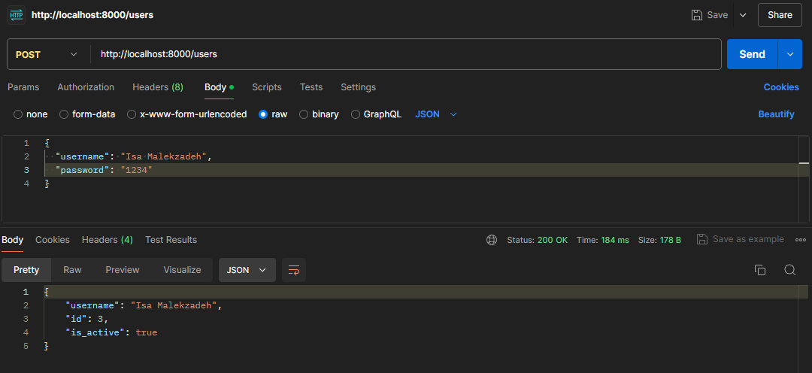

### momenteel ben ik nog niet geauthenticeerd.
Dit kan ik zien als ik de GET endpoint /users/me gebruik.
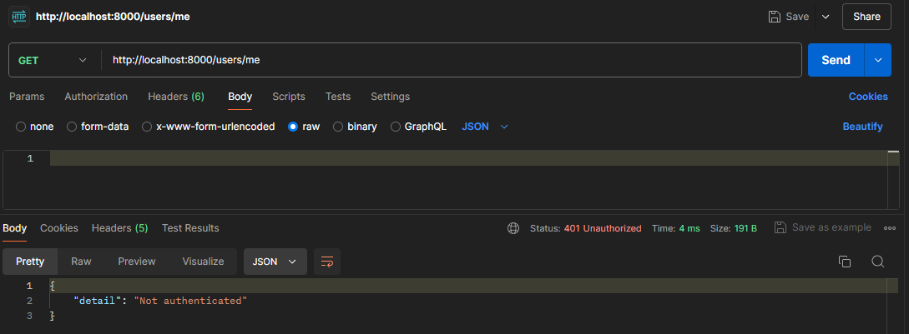

## POST (Token maken)
maar als ik een token aanvraag kan ik wel geauthenticeerd worden.
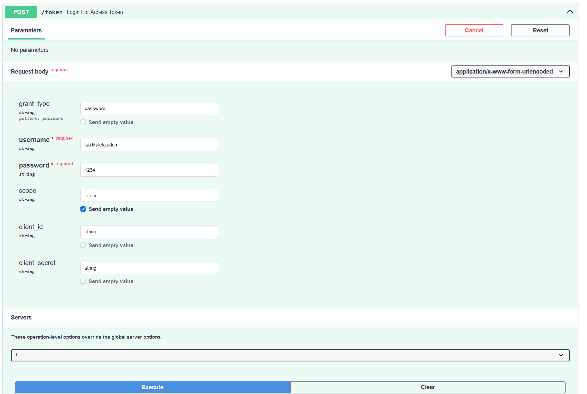
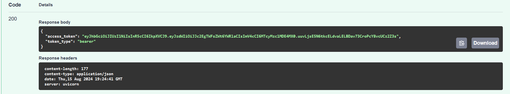
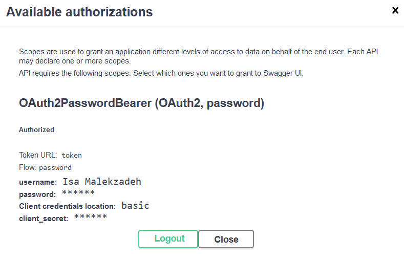

## POST (Het maken van een team)
Hiervoor gebruik je de POST enpoint /teams.
Het team dat gemaakt is heet "Redstrike" in de stad "Hasselt"
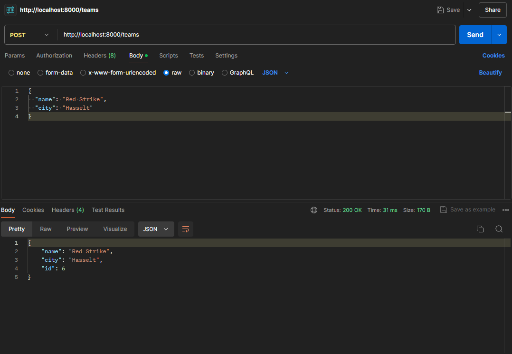

## GET (Het bekijken van een specifiek team)
Hiervoor gebruik je de GET endpoint /teams/{team_id}.
Voor het voorbeeld zullen we het team pakken met id 5.
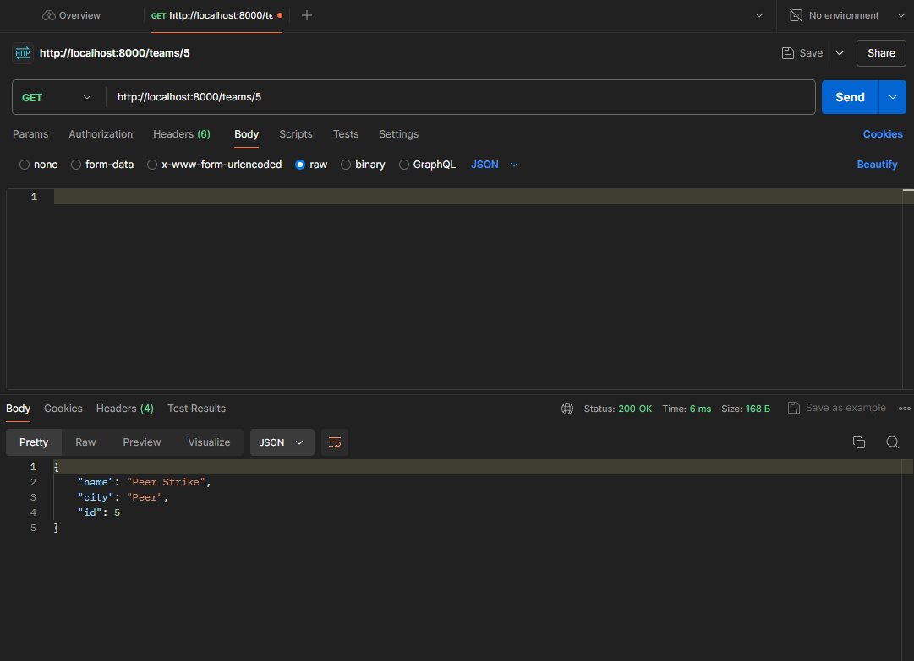

## GET (Het bekijken van alle teams die gemaakt zijn)
Hiervoor gebruik je de GET endpoint /teams
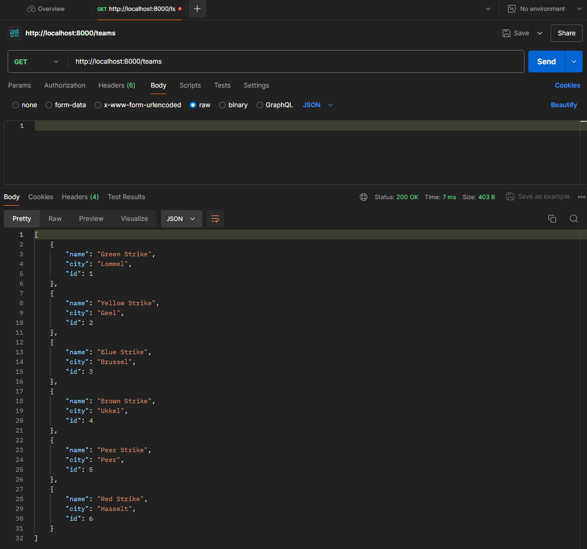

## GET (Het bekijken van een team(s) in een bepaalde stad)
Hiervoor gebruik je de GET endpoint /teams/by_city. Voor het voorbeeld zullen we "Geel" en "Genk" pakken

### Geel
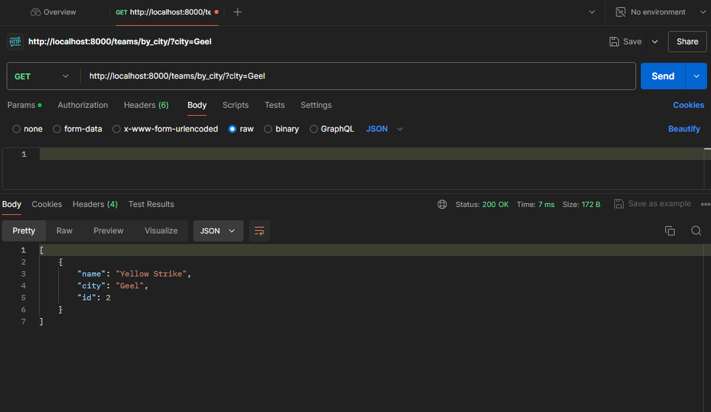

### Genk
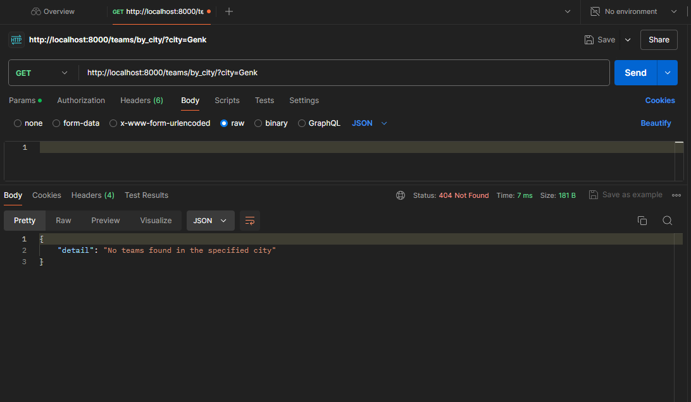

## PUT (Een team bijwerken)
Hiervoor gebruik je de PUT endpoint /teams/{team_id}. Voor het voorbeeld zullen we 
"Blue strike" uit "Brussel" nemen en de daam verranderen naar "BXL Strik".
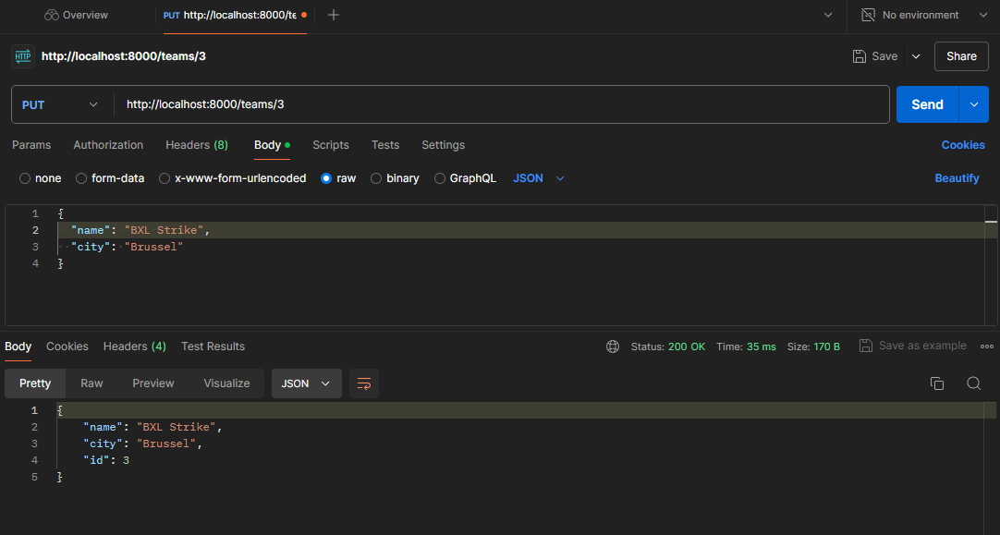

Als je nu een GET request voor team 3 vraagt krijg je het volgende.
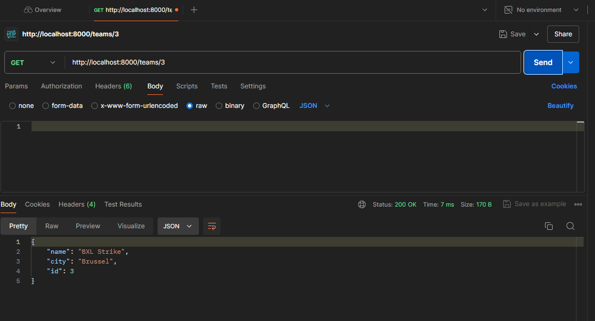

## DELETE (Een team verwijderen)
Hiervoor gebruik je de DELETE endpoint /teams/{team_id}. Voor het voorbeeld zullen we "Red Strike" uit "Hasselt"
verwijderen.
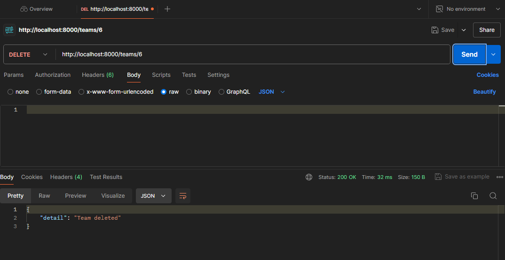

Als je nu een GET request doet voor alle teams zul je "Red Strike" niet terug kunnen vinden.
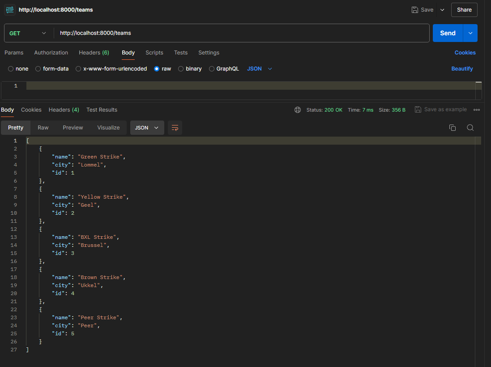

# DEMO FRONTEND
## https://youtu.be/uSR6PqjmW7s

## Pytest
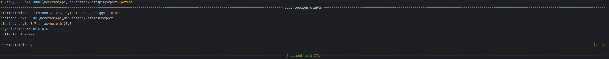
